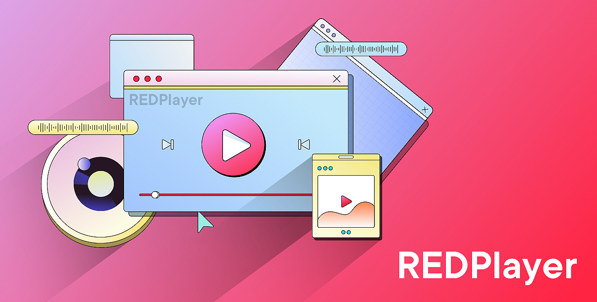

# REDPlayer




<!-- [GitHub issues](https://img.shields.io/github/issues/badges/RedPlayer/open) -->
<!-- [GitHub pull requests](https://img.shields.io/bitbucket/pr/badge/RedPlayer?label=pull%20requests) -->

### About REDPlayer

- REDPlayer is a cross-platform (supporting Android, iOS, HarmonyOS, and other platforms) player independently developed by Xiaohongshu. Different from other players in the industry, REDPlayer has the characteristics of simple structure, low coupling, and clear functional boundary. It provides a variety of access methods, and technicians can choose flexibly according to needs. They can quickly integrate SDK for use, or customize development based on source code.

- The purpose of REDPlayer is to enable developers to quickly and clearly understand the basic structure of the player, and make simple extensions according to personal needs to meet the diverse needs of different users. It can be used as a basic tool for students to learn, and also as a commercial platform for enterprises.

- REDPlayer supports various protocols and formats (such as HLS, MP4, FLV, etc.) in VOD and live broadcast scenarios, and can be expanded twice as many protocols (such as: RTC, etc.). Each module is decoupled, and developers can mount custom modules as needed, such as self-research decoders, renderers, and so on.

 Platform | Build Status
 -------- | ------------
 Android | Done
 iOS | Done
 others | In Coming

 ### Open Content

```bash
REDPlayer uses distributed open source methods like most open source projects in the industry. The content of each phase of open source can be found in the following documents.
```

- [CONTENTS.md](CONTENTS.md)

### Quickstart/Demo

- Android [Quickstart](source/android/README.md)/ [Demo](source/android/app/README.md)

- IOS [Quickstart](source/ios/README.md)/ [Demo](source/ios/RedPlayerDemo)

- In coming...

### Features

 Function | Function Description | Current Support Situation | Other Notes
 -------- | -------------------- | ------------------------- | -----------
 Rich Format | Supports rich audio and video formats such as FLV, HLS, MP4, MP3, and Vorbis | ✅ |  
 DASH Protocol | Supports standard protocol DASH | ✅ | Optimized version of DASH for on-demand support in the later stage
 HDR | Supports multiple HDR formats such as HDR10/HLG. Distribution and playback support are provided according to the model | ✅ | 
 URL Playback | Supports playback of local and network videos via URL | ✅ |  
 Log Reporting | Supports reporting player logs and statistics related to playback point information | ✅ | 
 Abnormal Analysis | Supports obtaining corresponding abnormal information through log analysis | ✅ | 
 H.264 Playback & Hardware Decoding | Supports H.264 video sources and hardware decoding | ✅ | 
 H.265 Playback & Hardware Decoding | Supports H.265 video sources and hardware decoding | ✅ | Software decoding capabilities will be supported in the later stage
 Automatic switching between software and hardware decoding | Automatically switches to software decoding when the terminal does not support hardware decoding | ✅ | 
 Playback Control | Supports playback control functions such as start, end, pause, and resume | ✅ | 
 Accurate Seeking | Supports accurate seeking to a specified position, which can be accurate to the frame level | ✅ | 
 Dynamic Dropping | Start dynamic dropping when the frame rate exceeds 60 fps | ✅ | 
 Replay | Supports manually triggered replay after the video ends | ✅ | 
 Continue playing | Supports setting the continuous playing time point | ✅ | 
 Loop Playback | Supports automatic replay after video playback ends | ✅ | Parameter configuration is required
 Variable Speed Playback | Supports variable speed playback of 0.5-2 times, and the audio实现variable speed without changing the pitch | ✅ | 
 Definition Adjustment | Supports switching between multiple definitions for on-demand and transcoding | ✅ | 
 Seeking within the Cache | Supports seeking without clearing the buffer for cached video content | ✅ | 
 Packing Mode | Supports picture cropping and filling | ✅ | 
 Private DRM | Supports private DRM encryption schemes | ✅ | 
 Adaptive Bitrate | When playing HLS/DASH, it supports automatically selecting the definition for playback through bandwidth prediction | ✅ | Currently only supports selection before playback, and does not support abr during playback
 Volume Settings | Supports real-time adjustment of system volume and mute operation | ✅ | 
 Pure Audio Playback | Supports playing audio only | ✅ | 
 Preload | Supports setting the preload size to reduce the time spent on the first screen | ✅ | 
 Play While Downloading | Supports playing while caching and downloading subsequent content, and you can set network policies | ✅ | 
 Playback Callback | Supports playback status callback, first frame callback, playback completion or failure callback | ✅ | 
 Retry on Playback Failure | Automatically retries on playback failure | ✅ | Only supports retries for non-4XX and 5XX classes
 Real-time Download Speed | Supports getting real-time download speed | ❌ | Will be supported in later versions
 Encrypted Streaming PlayBack | Support for on-demand transcoding of encrypted streams | ❌ | Need for custom development
 Screenshot Function | Support for capturing any frame of the playback picture | ❌ | Will be supported in later versions
 Thumbnail Preview | Support for previewing progress bar thumbnails (sprite map) | ❌ | Related to business, not currently supported
 Set player size | Support for customizing the width and height of the player | ❌ | Will be supported in later versions
 External subtitles | Support for two docking modes of external subtitles: full-link solution and pure client solution | ❌ | Will be supported in later versions
 Client super-resolution | The client performs super-resolution enhancement on low-quality videos | ❌ | Will be supported in later versions
 H.266 playback | Support for video playback in H.266 encoding format | ❌ | Will be supported in later versions
 AV1 playback | Support for video playback in AV1 encoding format | ❌ | Will be supported in later versions


### Usage
- You can directly integrate your project by calling the interface or compile independently.
- [INTERFACES.md](INTERFACES.md)

### Build Environment
- **Install Homebrew & Git**

	```bash
	/bin/bash -c "$(curl -fsSL https://raw.githubusercontent.com/Homebrew/install/HEAD/install.sh)"
	brew install git
	```
- **Build Android**

    **Using Android SDK**

	[Andrioid SDK](https://developer.android.com/studio?hl=en) is android project base dependency. You should download and then config with the following command:

	```bash
	# add this line to your ~/.bash_profile or ~/.profile, the android sdk will work
	export ANDROID_SDK=<your sdk path>
    export ANDROID_NDK=<your ndk path>

    # My build environment:
	# macOS 14.0
	# Android Studio Flamingo | 2022.2.1 Patch 2
	# gradle version: 7.5.0
	```
- **Build iOS**

	**Using CocoaPods**

	[CocoaPods](http://cocoapods.org) is a dependency manager for Cocoa projects. You can install it with the following command:

	```bash
	$ gem install cocoapods
	
	# My build environment:
	# macOS 14.0
	# Xcode 15.2 (15C500b)
	# Cocoapods version: 1.10.2
	# Ruby 3.0.6p216
	```

### Latest Changes
- [NEWS.md](NEWS.md)

### Support
- Please try to discuss technical issues (https://github.com/RTE-Dev/RedPlayer/issues) publicly on github, and do not inquire privately by email. We will not reply one by one.


### Licence
#### Self Licence
```
Copyright (c) 2024 xiaohongshu
Licensed under LGPLv2.1 or later
```
#### Dependence Licence
 - ffmpeg: LGPL v2.1+
 - soundtouch: LGPL v2.1
 - libcurl: MIT License
 - c-ares: MIT License
 - glide: MIT License
 - Masonry: MIT License
 - openssl: Apache License 2.0
 - PictureSelector: Apache License 2.0

### Law And Rule
All rights and explanations belong to Xiaohongshu，you should always ask your lawyer for these stuffs before use it in your product.

###  Join US
Apply to join REDPlayer by scanning the Wechat code. （Please note ‘REDPlayer when applying friends）

