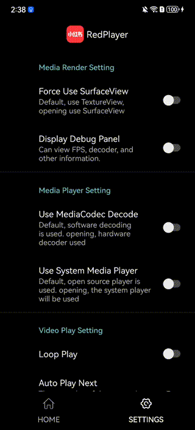

# Usage Guide - DEMO

## Before Run

Before building the SDK, please make sure you have the following dependencies installed:

1. **Git:** Ensure that Git is installed on your machine. If not, you can download and install it from [https://git-scm.com/](https://git-scm.com/). Or using the following command:

    ```bash
    brew install git
    ```

2. **Android SDK:** [Andrioid SDK](https://developer.android.com/studio?hl=en) is android project base dependency. You should download and then config with the following command:
	```bash
	# add this line to your ~/.bash_profile or ~/.profile, the android sdk will work
	export ANDROID_SDK=<your sdk path>
    export ANDROID_NDK=<your ndk path>

    # My build environment:
	# macOS 14.0
	# Android Studio Flamingo | 2022.2.1 Patch 2
	# gradle version: 7.5.0
	```

## My Run Environment
- macOS 14.0
- Android Studio Flamingo | 2022.2.1 Patch 2
- gradle version: 7.5.0

## Example Run
To run the example project, clone the repo, and run `./gradlew installDebug` from the Example directory first.

1. Clone the repository
   ```bash
   git clone https://github.com/RTE-Dev/RedPlayer.git
   ```

2. Navigate to the demo project directory
    ```bash
	cd RedPlayer/source/android
    ```
    
3. Build and Install RedPlayer-Demo.apk to your android phone
    ```bash
	./gradlew installDebug
    ```


### Demo
click to download [RedPlayer-Demo.apk](../docs/RedPlayer-Demo.apk)<br>
 &nbsp;&nbsp;  <br><br>


# 📌How to integrate RedPlayer into your Android project

## Requirements

- Android Phone System 5.0+

## ▶️ Getting Started

### 1. Create a PlayerDemo Project

Start by creating a new android project named `PlayerDemo`

### 2. Setup Dependency

In the root directory of your project, create a `app module` and open the  `build.gradle` file

```java
// add the RedPlayer SDK and RedPreload SDK
dependencies {
    implementation project(path: ':OpenRedPlayerCore')
    implementation project(path: ':OpenRedPreload')
}   
```

This module includes dependencies on local **RedPlayer SDK**, **RedPreload SDK** and **ffmpeg**, **opensoundtouch**.

### 3. Build & Install

Run the following command in the terminal to build and install your demo:

```
$ ./gradlew installDebug
```
Then you `app module` will build the apk and auto install you android phone.
