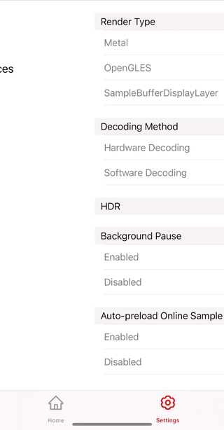

# Usage Guide - DEMO

## Before Run

Before building the SDK, please make sure you have the following dependencies installed:

1. **Git:** Ensure that Git is installed on your machine. If not, you can download and install it from [https://git-scm.com/](https://git-scm.com/). Or using the following command::

    ```bash
    brew install git
    ```

2. **CocoaPods:** The SDK uses CocoaPods for dependency management. If you don't have CocoaPods installed, you can install it using the following command:

    ```bash
    sudo gem install cocoapods
    ```

## My Run Environment


- macOS 14.0
- Xcode 15.2 (15C500b)
- Cocoapods version: 1.10.2
- Ruby 3.0.6p216

## Example Run
To run the example project, clone the repo, and run `pod install` from the Example directory first.

1. Clone the repository
	```bash
	git clone https://github.com/RTE-Dev/RedPlayer.git
   ```
2. Navigate to the RedPlayerDemo directory
    ```bash
	cd RedPlayer/source/ios/RedPlayerDemo
    ```
3. Install dependencies using CocoaPods
    ```bash
	pod install
    ```
    
4. Open the generated `RedPlayerDemo.xcworkspace` 

### Demo
 &nbsp;&nbsp; 

&nbsp;

# 📌How to integrate RedPlayer into your Xcode project

## Requirements

- iOS 10.0+

## ▶️ Getting Started

### 1. Create a PlayerDemo Project

Start by creating a new Xcode project named `PlayerDemo.xcodeproj` 

### 2. Setup Podfile

In the root directory of your project, create a `Podfile` with the following content:

```ruby
source 'https://github.com/CocoaPods/Specs.git'
platform :ios, '10.0'
use_frameworks!

def pods_dependency
  pod "XYMediaFfmpeg", :path => "./Submodules/XYMediaFfmpeg"
  pod "opensoundtouch", :path => "./Submodules/opensoundtouch"
  pod "RedPlayer", :path => "../"
end

target 'PlayerDemo' do
  project 'PlayerDemo'
  pods_dependency
end
```

This Podfile includes dependencies on local **RedPlayer framework**, and **ffmpeg**, **opensoundtouch** dynamic frameworks.

### 3. Install Dependencies

Run the following command in the terminal to install the dependencies:

```
$ pod install
```


### 4. Run the Demo

Open the generated `PlayerDemo.xcworkspace` file and build/run the project. You can now explore the RedPlayer demo by executing it within Xcode.

**If you encounter a crash when launching with opensoundtouch, please manually integrate the opensoundtouch.framework into your project target. Using "Embbed & Sign"**

